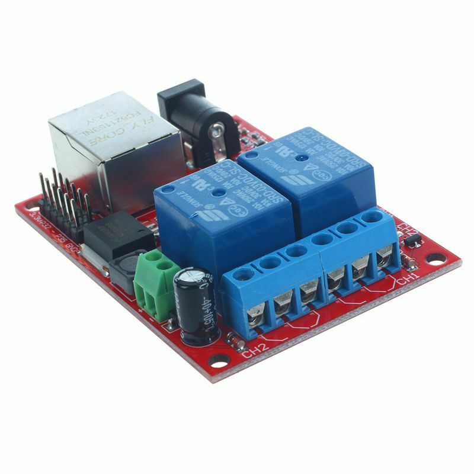

# sr201-mqtt  
  
**MQTT to SR201 module interface.**  

The sr-201 is a network connected 2 channel relay module available through eBay and other sellers.
This code is designed to allow it to be controlled from commands passed via an MQTT topic 
(https://mqtt.org/). The status from the operation is passed back to a status MQTT topic. 
Both these topics are defined in the config file.

Currently this code works stand alone, future work will be to package this in a Docker container.

Sometimes this module is described as http controlled, this is *not* the case, 
it doesn't contain a web server, it is controlled by sending codes to a tcp (or udp) port.
You cannot point your web browser to it directly.

Also, it has been described as capable of switching 240V at 10A, I am very much not 
convinced of this, the relays on the module are rated as such, but the pcb track widths 
don't seem wide enough for 10A and the track spacing doesn't look far enough for 240v. 
I use this module to switch 12v which actuates a DIN rail mounted relay which is 
suitable for 240v.
Please be warned and consider very carefully if you feel it is safe to switch mains directly.

This code draws heavily on the sr-201 code from Cryxli in Github 
(https://github.com/cryxli/sr201) and examples of MQTT in Python 
from 'Steve' (http://www.steves-internet-guide.com).  
  

This code is configured from a config file which is itself, Python, 
this allows easy import of parameters. All the parameters I think you 
should need to change are in this file. Please rename the config.py.example to config.py
config.py.example ships to avoid overwriting any local changes you have made if you 
pull new code from github. 
Please send me a message if this is not the case.  

Both the MQTT broker and sr-201 addresses can be either DNS names or ipaddresses.

The MQTT topic does not *have* to correspond to the sr-201 channel, 
but in practice it would probably be best to have these correspond 
for ease of use. 
The topic does not reference the channel number for this reason.
  
Valid commands are:-  

	 # 00 Obtain relay status, toggles nothing. 
	 # 11 Turn relay 1 on 
	 # 21 Turn relay 1 off 
	 # 12 Turn relay 2 on 
	 # 22 Turn relay 2 off  
 
Although there is a '*n' option to toggle the relay on and then off after 'n' seconds, this is not 
implemented as it can be achieved through sending to the MQTT topic. If this would be useful to you,
please let me know.
  
  
**To Do:-**  
1. Support MQTT topic which requires username and password.
2. Support MQTT encryption.
3. Implement some sort of network access control to restrict addresses allowed to talk to it.
4. Handle non responsive or offline relay module without exception. 
